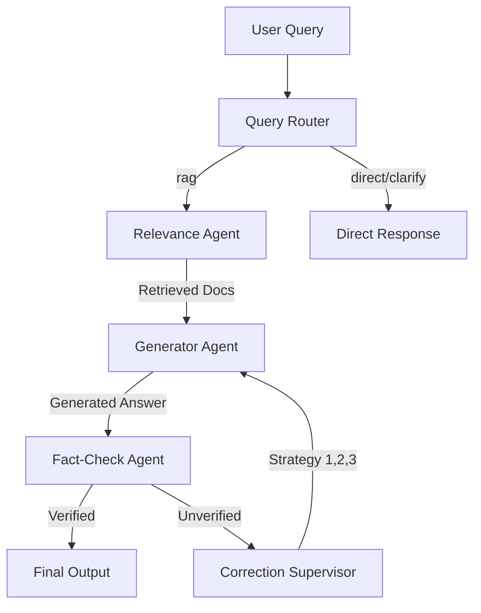

# Architecture Overview

## Multi-Agent RAG Pipeline

## Self-Correction Loop
When the **Fact-Check Agent** detects a hallucination, it flags the verification status as "Unverified". The **Correction Supervisor** then intercepts the response and applies one of three fallback strategies:
1. **Expand Retrieval**: Re-run the retriever with a larger `TOP_K` (e.g. +5).
2. **Query Rewriting**: Uses an LLM to rephrase the query for better search term overlap.
3. **Strict Mode**: Temporarily sets LLM temperature to 0.0 and enforces a strict system prompt.

## Data Flow
Documents are loaded, hashed, and stored in a local SQLite database (`app.db`). Their text is semantically chunked and embedded using BAAI/bge-base-en-v1.5 and stored into a ChromaDB vector index and BM25 sparse index for Reciprocal Rank Fusion (RRF) retrieval.
